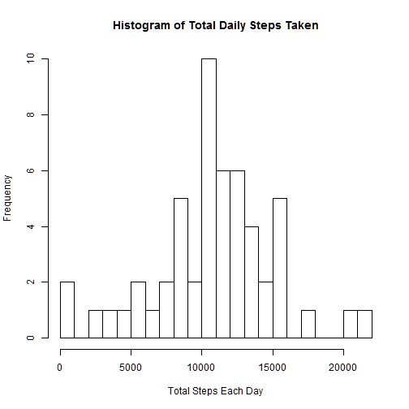
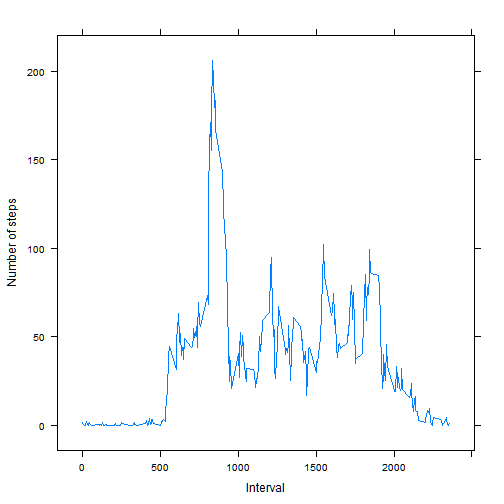
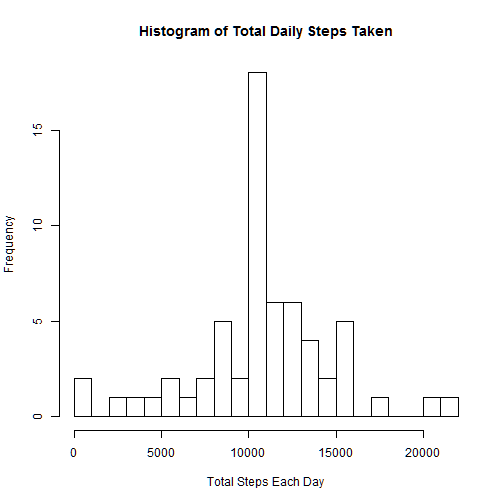
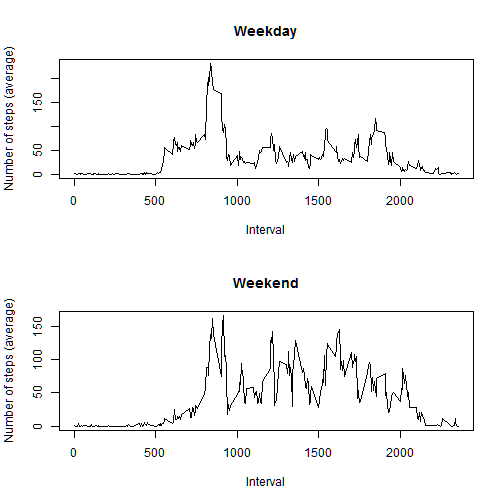

## The project: 
This project was assigned by Roger Peng under the class Reproducible research in the Coursera Data Science Track. The goal is to examine physical activity through the data and week using and activity monitoring device. The original dataset can be retrieved from URL presented later in the code. 

## Loading and preprocessing the data
I downloaded the file from the url given in the assignment. 
Then, I unzipped it, read the .csv data file in under the name activtyData and coverted the date column to an R date format to ease analysis.


```r
fileURL <- "http://d396qusza40orc.cloudfront.net/repdata%2Fdata%2Factivity.zip"
download.file(fileURL, "activityDataFile.zip")
unzip("activityDataFile.zip")
activityData <- read.csv("activity.csv")
activityData$date <- as.Date(activityData$date)
```

## What is mean total number of steps taken per day?
I computed the mean, median, and sum data by doing the following:
First, I aggregated the steps into a total sum for each day. Then, I made a histogram of these totals each day. Next, I took a mean of the total steps per day column to produce an average number of total daily steps. Finally, I used the median function to get the median of the totals by day.


```r
totalDailySteps <- aggregate(steps ~ date, activityData, sum)

head(totalDailySteps)
```

```
##         date steps
## 1 2012-10-02   126
## 2 2012-10-03 11352
## 3 2012-10-04 12116
## 4 2012-10-05 13294
## 5 2012-10-06 15420
## 6 2012-10-07 11015
```

```r
hist(totalDailySteps[, 2], breaks = 20, xlab = "Total Steps Each Day", main = "Histogram of Total Daily Steps Taken")
```

 
The mean of the daily steps was found to be 10766.19 and the median is 10765.

```r
mean(totalDailySteps[, 2])
```

```
## [1] 10766.19
```

```r
median(totalDailySteps[,2])
```

```
## [1] 10765
```

## What is the average daily activity pattern?

```r
meanDailyStepsByInterval <- aggregate(steps ~ interval, activityData, mean)
library('lattice')
xyplot(steps ~ interval, meanDailyStepsByInterval, xlab = "Interval", ylab = "Number of steps", type = "l")
```

 
The time interval with the most steps is found to be 835.

```r
which(meanDailyStepsByInterval == max(meanDailyStepsByInterval[2]), arr.ind = TRUE)
```

```
##      row col
## [1,] 104   2
```
where the value is:


```r
max(meanDailyStepsByInterval[,2])
```

```
## [1] 206.1698
```

```r
## And the specific interval is :

meanDailyStepsByInterval[104, 1]
```

```
## [1] 835
```
## Imputing missing values
For the second part, I find the number of complete cases and build a table. Then, I can subtract the good cases from the total number of obs. Another way to do this is by simply calculating the number of bad cases as shown.

I make the good data first:


```r
good <-complete.cases(activityData)

goodData<-activityData[good,][,]
nrow(goodData)
```

```
## [1] 15264
```

```r
nrow(activityData) - nrow(goodData) ##This is the number of bad rows
```

```
## [1] 2304
```


## The second method:

badData <- activityData[!good,][,]
nrow(badData)
```
# Replacing Missing Data
 To fill in the missing data, I use my mean data calcuated at each time interval from before:

```r
newActivityData <- activityData
for (i in 1 : (nrow(activityData) )){
  if (  is.na( activityData[ i , 1] ) ) {
    newActivityData[ i , 1] <- meanDailyStepsByInterval[ ( ( i - 1 ) %% ( nrow(meanDailyStepsByInterval) ) + 1 ), 2]
  }
}
```
As confirmation of my replacement, I have shown the front and back of each of the tables, where NA values dominate. 


```r
head(newActivityData)
```

```
##       steps       date interval
## 1 1.7169811 2012-10-01        0
## 2 0.3396226 2012-10-01        5
## 3 0.1320755 2012-10-01       10
## 4 0.1509434 2012-10-01       15
## 5 0.0754717 2012-10-01       20
## 6 2.0943396 2012-10-01       25
```

```r
tail(newActivityData)
```

```
##           steps       date interval
## 17563 2.6037736 2012-11-30     2330
## 17564 4.6981132 2012-11-30     2335
## 17565 3.3018868 2012-11-30     2340
## 17566 0.6415094 2012-11-30     2345
## 17567 0.2264151 2012-11-30     2350
## 17568 1.0754717 2012-11-30     2355
```

```r
head(meanDailyStepsByInterval)
```

```
##   interval     steps
## 1        0 1.7169811
## 2        5 0.3396226
## 3       10 0.1320755
## 4       15 0.1509434
## 5       20 0.0754717
## 6       25 2.0943396
```

```r
tail(meanDailyStepsByInterval)
```

```
##     interval     steps
## 283     2330 2.6037736
## 284     2335 4.6981132
## 285     2340 3.3018868
## 286     2345 0.6415094
## 287     2350 0.2264151
## 288     2355 1.0754717
```

##The Histogram of the Data with Replaced Values:

```r
totalDailySteps <- aggregate(steps ~ date, newActivityData, sum)
hist(totalDailySteps[, 2], breaks = 20, xlab = "Total Steps Each Day", main = "Histogram of Total Daily Steps Taken")
```

 

## The mean and median of the data with artificially replaced  values are:

```r
mean(totalDailySteps[,2])
```

```
## [1] 10766.19
```

```r
median(totalDailySteps[,2])
```

```
## [1] 10766.19
```
By looking the mean (107.66.19) and median (10765) from before, it can be seem that any change in the mean is not detectable. In addition, due to relative proximity of the median and mode, the change in the median was small and calculated to be less than 2 hundreths of a percent change:


```r
percentDifference <- 100 * (10766.19 - 10765)/(10765)
print(percentDifference)
```

```
## [1] 0.01105434
```

# Looking at Weekends Vs. Weekdays:


```r
# I use the as.Date function to convert my dates into days of the week. 
weekValue <- (weekdays(as.Date(newActivityData$date)))
big <- cbind(newActivityData, weekValue)
big$weekValue <- as.character(big$weekValue) # I need to convert to character to do my check later.

# I do a check and substitution if the day is Satuday or Sunday with weekend, otherwise, I rename the value "Weekday"
for (step in 1:nrow(newActivityData)){
    if ( ( big[step, 4] == "Sunday" ) || ( big[step, 4] == "Saturday") ){
      big[step, 4 ] <- "Weekend"
    # print("Weekend")
      }
    else {
      big[step, 4] <- "Weekday"
    }
}
  head(big)
```

```
##       steps       date interval weekValue
## 1 1.7169811 2012-10-01        0   Weekday
## 2 0.3396226 2012-10-01        5   Weekday
## 3 0.1320755 2012-10-01       10   Weekday
## 4 0.1509434 2012-10-01       15   Weekday
## 5 0.0754717 2012-10-01       20   Weekday
## 6 2.0943396 2012-10-01       25   Weekday
```

```r
bigWeek <- subset(big, big$weekValue == "Weekday",) # I break up the data set so that I can graph separately. This isn't necessary, but it made it simpler for me.

bigWeekAve <- aggregate(steps ~interval, bigWeek, mean)
bigEnd <- subset(big, big$weekValue == "Weekend",)
bigEndAve <- aggregate(steps ~interval, bigEnd, mean)
##bigAverage <- aggregate(x = big, list(interval), FUN = mean)

## Are there differences in activity patterns between weekdays and weekends?
par(mfrow = c(2, 1))

plot(bigWeekAve$interval, bigWeekAve$steps, type = "l", xlab = "Interval", ylab = "Number of steps (average)", main = "Weekday")
plot(bigEndAve$interval, bigEndAve$steps, type = "l", xlab = "Interval", ylab = "Number of steps (average)", main = "Weekend")
```

 
